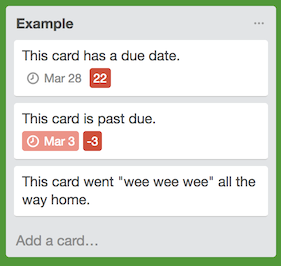

#Trello Days Left Power-Up

This simple power-up adds a badge to cards with a due date to
illustrate the number of days left. To use, visit the [Trello
Power-Ups admin page](https://trello.com/power-ups/admin), pick a
team, and select "Create New Power-Up." Then add
[https://anjiro.github.io/trello_date_powerup/manifest.json](https://anjiro.github.io/trello_date_powerup/manifest.json) as the manifest.
Load a board and add the "Days Till Due" powerup.

